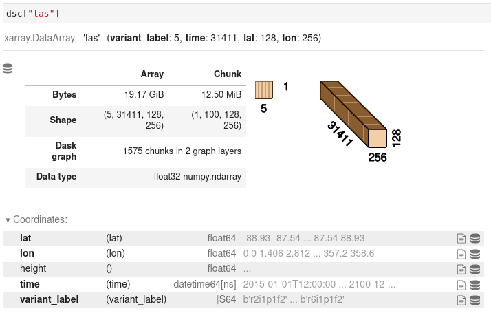

# ESGF Virtual Aggregation

[](https://mybinder.org/v2/gh/zequihg50/eva/HEAD?labpath=demo.ipynb)

Remote data access to Virtual Analysis Ready Data (Virtual ARD) for climate datasets of the [ESGF](https://esgf.llnl.gov/).

## Demo

Query the ESGF Virtual Aggregation catalog and get the URL of a dataset:

```python
import pandas as pd

# Load the inventory
df = pd.read_csv("https://hub.ipcc.ifca.es/thredds/fileServer/inventory.csv")

# Find a dataset
subset = df.query("aggregation == 'ensemble' & product == 'ScenarioMIP' & model == 'CNRM-CM6-1' & experiment == 'ssp245' & table == 'day' & variable == 'tas' & version == 'v20190410'")

# See available data nodes
subset[["location", "data_node"]]

# Select a data node and get the url
url = subset.query("data_node == 'aims3.llnl.gov'")["location"].iloc[0]
```

Open the URL with an OPeNDAP compatible client (see [xarray](https://docs.xarray.dev/en/stable/) and [climate4R](https://github.com/SantanderMetGroup/climate4R)).

```python
import xarray

ds = xarray.open_dataset(url)
print(ds)

# query the size of the dataset on the server side
ds.attrs["size_human"]

# view the variant_label coordinate
ds["variant_label"][...]
```

or

```R
library(loadeR)

di<-dataInventory(url)
```

Scale with [dask](https://www.dask.org/) (xarray only):

```python
ds_chunked = ds.chunk({"variant_label": 1, "time": 100})
print(ds_chunked)
```

Trivial conversion to a Zarr store:

```
ds_chunked.to_zarr("CMIP6_ScenarioMIP_CNRM-CERFACS_CNRM-CM6-1_ssp245_day_tas_gr_v20190410_aims3.llnl.gov.zarr")
```

## Rationale

The ESGF is a federated file distribution service for climate data. Remote data access and virtual datasets are possible through OPeNDAP and netCDF-java, available by default in all ESGF nodes. However, these capabilities have never been used. This provides:

- Analysis Ready Data (ARD) in the form of virtual datasets, that is, no data duplication needed.
- Remote data access without the need to download files. Open an URL and get direct access to an analytical data cube.

### Note for the Pangeo community

This work is a bridge between the current state of the federation and more elaborated [ETL](https://es.wikipedia.org/wiki/Extract,_transform_and_load) attemps such as [Google CMIP6](https://gallery.pangeo.io/repos/pangeo-gallery/cmip6/basic_search_and_load.html) from [Pangeo](https://pangeo.io/). The later is a much more expensive workflow that requires duplication of the datasets into a cloud provider, which in advantage offers much more scalable data service compared to the "best effort" basis of the ESGF data nodes. Also, the ESGF Virtual Aggregation offers a higher level Analysis Ready Dataset by adding the `ensemble` dimension to the variables.



The ESGF Virtual Aggregation could act as an intermediate between the ESGF and cloud native repositories. Because ESGF Virtual Aggregation is much cheaper to run (since it only reads metadata from the ESGF distributed index), cloud repositories using cloud optimized formats (Zarr) can be created much easier. For example:

```python
import xarray
import dask

dask.config.set(scheduler="processes")

# Open a dataset from the ESGF Virtual Aggregation
ds = xarray.open_dataset("https://hub.ipcc.ifca.es/thredds/dodsC/esgeva/ensemble/CMIP6/ScenarioMIP/day/CMIP6_ScenarioMIP_CNRM-CERFACS_CNRM-CM6-1_ssp245_day_gr_v20190410/replicas/aims3.llnl.gov/CMIP6_ScenarioMIP_CNRM-CERFACS_CNRM-CM6-1_ssp245_day_tas_gr_v20190410_aims3.llnl.gov.ncml").chunk({"variant_label": 1, "time": 100})

# Store as Zarr in a directory store
ds.to_zarr("CMIP6_ScenarioMIP_CNRM-CERFACS_CNRM-CM6-1_ssp245_day_tas_gr_v20190410_aims3.llnl.gov.zarr")
```

## Usage

The ESGF Virtual Aggregation data involves two steps:

1. Query ESGF fedeartion for metadata and store it in a local SQL database.
2. Generate virtual aggregations (NcMLs) from the SQL database.

ESGF Virtual Aggregation is fully customizable via `selection` files. See the sample file `selection-sample`.

The following code generates the metadata SQL database from the `selection-sample` file.

```bash
python search.py -d sample.db -s selection-sample
```

Now, generate the virtual aggregations (both `esgf_dataset` and `esgf_ensemble`) from the database using 4 parallel jobs.

```bash
python ncmls.py -j4 --database sample.db -p esgf_dataset
python ncmls.py -j4 --database sample.db -p esgf_ensemble
```

You will find that the virtual aggregations are NcML files. You will need a client based on netCDF-java to read them
or you can also set up a TDS server and read via OpenDAP. See next section.

### Run your own ESGF Virtual Aggregation

A THREDDS Data Server (TDS) with access to the ESGF Virtual Aggregation datasets is available at `https://hub.ipcc.ifca.es/thredds`.

You may deploy your own THREDDS Data Server and perform remote data analysis on the ESGF Virtual Aggregation
dataset.

```bash
docker run -p 8080:8080 -v $(pwd)/content:/usr/local/tomcat/content/thredds unidata/thredds-docker:5.0-beta7
```

Now, visit `localhost:8080/thredds` and inspect the server's directory. You may download the NcML from the HTTPServer
endpoint or use the OpenDAP service to get the OpenDAP URL (it should look like `http://localhost:8080/thredds/dodsC/...`).

The OpenDAP service may be used to perform remote data analysis using xarray.

```python
import xarray,dask

dask.config.set(scheduler="processes")

url = "http://localhost:8080/thredds/dodsC/esgeva/demo/CMIP6_CMIP_AS-RCEC_TaiESM1_historical_day_tas_gn_v20200626_esgf.ceda.ac.uk.ncml"
ds = xarray.open_dataset(url).chunk({"time": 100})

# query the size of the dataset on the server side
ds.attrs["size_human"]

# view the variant_label coordinate
ds["variant_label"][...].compute()

# compute spatial mean for all variant_labels
# this involves transferring the necessary data from the server
means = ds["tas"].mean(["lat", "lon"]).compute()
means
```

See the notebooks for usage and reproducibility.
